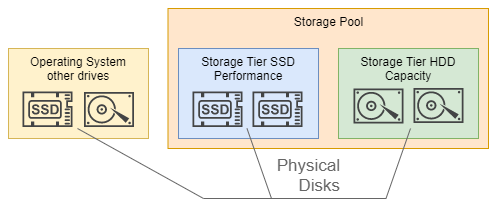
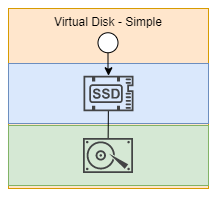
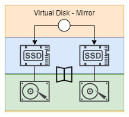
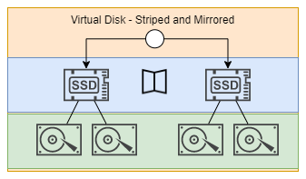
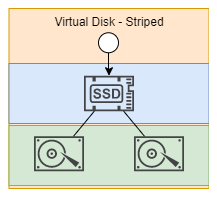

# Create Storage Spaces in Windows 10
Windows Server O/S contains Storage Spaces support for fault domains and tiered storage.
Windows 10 support Storage Spaces with a GUI Control Panel that does not include the tiered storage GUI. 

These scripts create tiered storage pools that integrate SSDs as caching drives and HDDs as storage drives. They assume you have at least one SSD and two HDDs.  


* The scripts automatically find all raw drives and add them to the pool.  
* Some HDDs have their types incorrectly identified.  The script can coerce them to be MediaType:HDD
* The entire virtual drive is added to the system as a single large volume
* You need at least 
  * 1 SSD and 1 HDD to run cached storage / Simple resiliency
  * 2 SSD and 2 HDD to run cached storage / Mirror resiliency / 
  * 1 SSD and 2 HDD to run cached storage / Simple resiliency / striped storage (sum of HDD space)

  

# Scripts 
## new-storage-space.ps1
Creates a tiered storage pool and allocates all the disk space to a single drive
* You can change the drive letter and label by editing the variables at the top.
* the script can auto size the drive and cache.  That didn't work for me so the script supports manual sizing.

## remove-storage-space
Removes the virtual drive, the storage tiers and then the storage pool.
* All drives are returned the _Primordial_ pool

# Sample configuration
_new-storage-space.ps_ took my three Physical Drives
* two 2TB HDD 
* one 200GB SSD.  

and built a Virtual Drive 
* single _striped_ 3.6TB data volume 
* fronted with a 200GB read/write cache.

 

## Win 10 Pro Storage Spaces Control Panel
The control panel does not display or manipulate tiers


## Simple vs Mirror
It attempts to mirror both tiers so you would need 4 drives run mirror, to mirror both tiers

## Meaningless Benchmark
All Storage Pool drives connected to 3Gb/s SATA


```
[Read]                           *Single 2TB no cache*           *Two 2TB mirrored with 200GB cache*
Sequential 1MiB (Q=  8, T= 1):   160.497 MB/s [    153.1 IOPS]   282.983 MB/s [    269.9 IOPS]
Sequential 1MiB (Q=  1, T= 1):   156.766 MB/s [    149.5 IOPS]   254.605 MB/s [    242.8 IOPS]
    Random 4KiB (Q= 32, T=16):     1.748 MB/s [    426.8 IOPS]   175.272 MB/s [  42791.0 IOPS]
    Random 4KiB (Q=  1, T= 1):     0.527 MB/s [    128.7 IOPS]    21.189 MB/s [   5173.1 IOPS]

[Write]                          *Single 2TB no cache*           *Two 2TB mirrored with 200GB cache*
Sequential 1MiB (Q=  8, T= 1):   153.896 MB/s [    146.8 IOPS]   226.825 MB/s [    216.3 IOPS]
Sequential 1MiB (Q=  1, T= 1):   154.147 MB/s [    147.0 IOPS]   230.149 MB/s [    219.5 IOPS]
    Random 4KiB (Q= 32, T=16):     2.033 MB/s [    496.3 IOPS]   149.000 MB/s [  36377.0 IOPS]
    Random 4KiB (Q=  1, T= 1):     1.706 MB/s [    416.5 IOPS]    38.790 MB/s [   9470.2 IOPS]

```


# Credits
* Most of the script came from this great [blog article by Nils Schimmelmann](https://nils.schimmelmann.us/post/153541254987/intel-smart-response-technology-vs-windows-10)